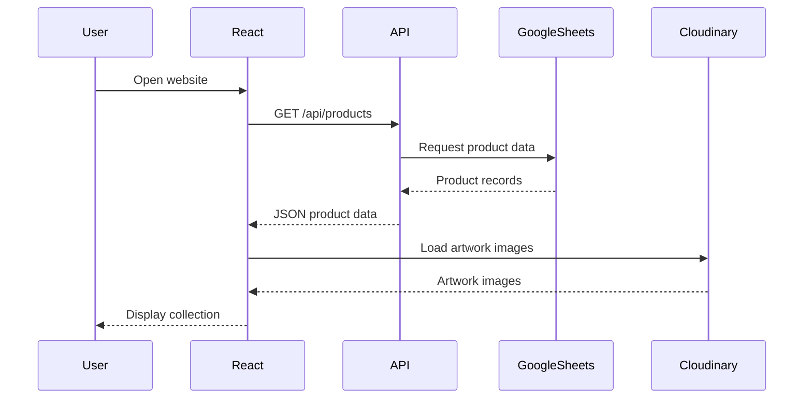
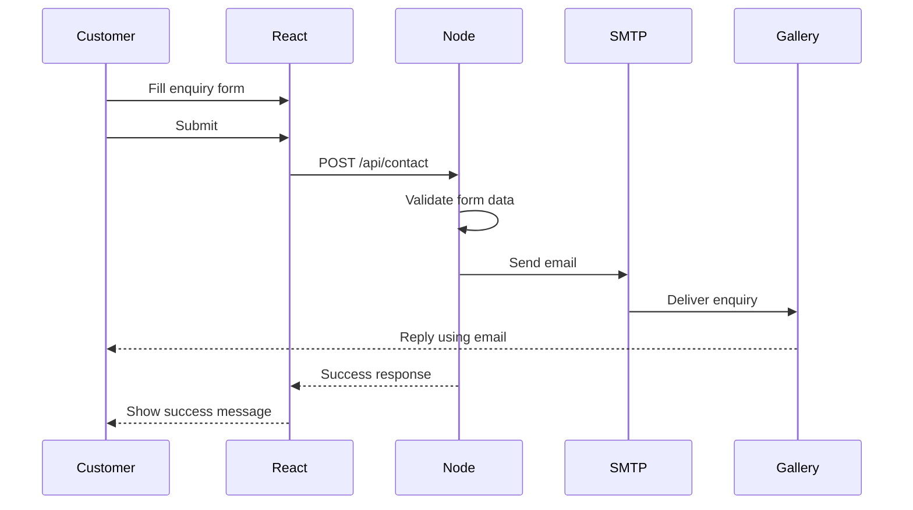
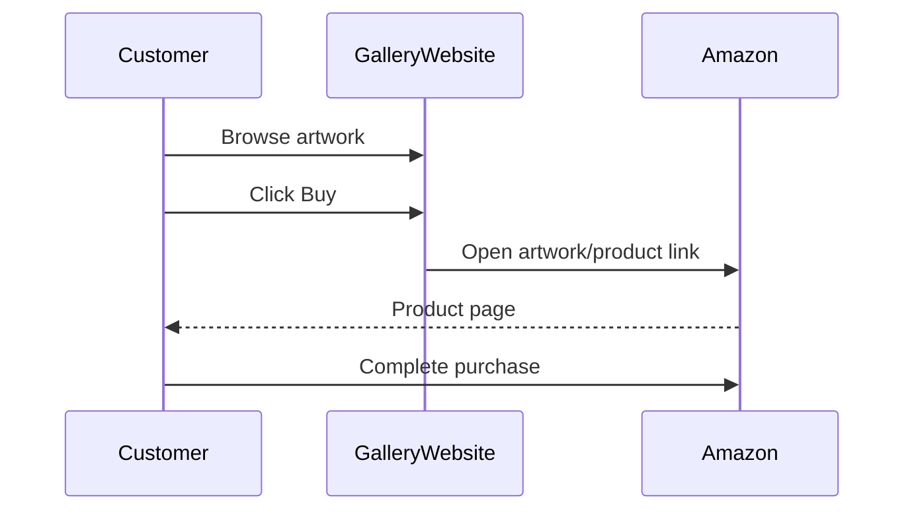
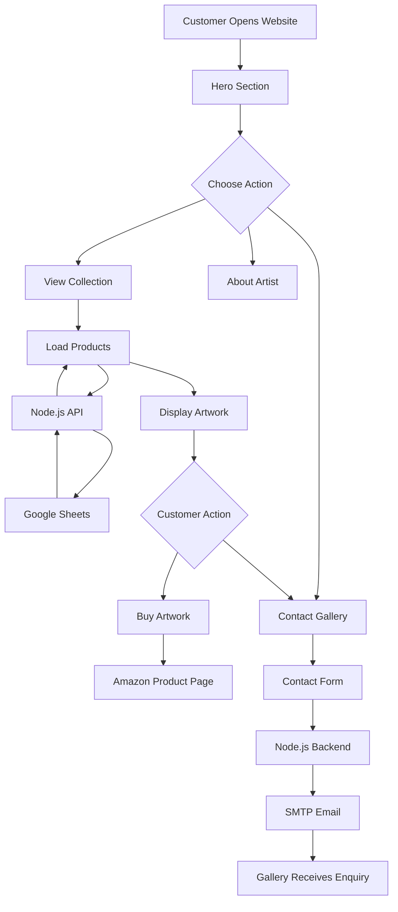

Absolutely. For a project like **Pranu Art Gallery**, I would make the README more than just a setup guide. It can work as a **complete project documentation** covering the idea, architecture, development phases, workflows, integrations, diagrams, challenges, and future improvements.

Since you want documentation for the **whole project**, I can structure it like this:

# 📖 Pranu Art Gallery — Complete Project Documentation

### 1. Project Overview

* Project introduction
* Problem statement
* Project objective
* Target users
* Key highlights

### 2. Technology Stack

* React.js
* Node.js
* Express.js
* Google Sheets
* Cloudinary
* Amazon product links
* Nodemailer / SMTP
* Vercel
* CSS animations

### 3. Features

#### Customer-facing

* Artistic landing page
* Navigation
* Hero section
* Animated artistic background
* Artist profile
* Artwork collection
* Product details
* Buy artwork functionality
* Contact/enquiry form
* Email enquiry system
* Social media links
* Amazon integration
* Responsive design
* Favicon

#### Technical

* REST API
* Google Sheets as product data source
* Cloudinary image hosting
* SMTP email integration
* Environment variables
* CORS
* Error handling
* Responsive CSS
* CSS animations

### 4. System Architecture

Something like:

```text
                    ┌──────────────────────┐
                    │      CUSTOMER        │
                    └──────────┬───────────┘
                               │
                               ▼
                    ┌──────────────────────┐
                    │    REACT FRONTEND    │
                    │                      │
                    │  Home               │
                    │  Collection         │
                    │  About Artist        │
                    │  Contact Form       │
                    └───────┬───────┬──────┘
                            │       │
                    API      │       │ Contact
                            │       │
                            ▼       ▼
                  ┌─────────────┐  ┌─────────────┐
                  │ Node/Express│  │ SMTP Server │
                  │   Backend   │  │  / Email    │
                  └──────┬──────┘  └──────┬──────┘
                         │                 │
                         ▼                 ▼
                  ┌─────────────┐    ┌─────────────┐
                  │Google Sheets│    │ Gallery     │
                  │Product Data │    │ Email       │
                  └─────────────┘    └─────────────┘

                         │
                         ▼
                  ┌─────────────┐
                  │ Cloudinary  │
                  │ Artwork     │
                  │ Images      │
                  └─────────────┘

                         │
                         ▼
                  ┌─────────────┐
                  │   Amazon    │
                  │   Purchase  │
                  └─────────────┘
```

### 5. Complete Development Workflow

We can document the actual sequence:

```text
Requirement Gathering
        ↓
UI/UX Planning
        ↓
Frontend Development
        ↓
Hero & Gallery Design
        ↓
Product Data Structure
        ↓
Google Sheets Integration
        ↓
Backend API Development
        ↓
Cloudinary Image Integration
        ↓
Amazon Purchase Integration
        ↓
Contact Form Development
        ↓
SMTP Email Integration
        ↓
Responsive Design
        ↓
Animations & Artistic Theme
        ↓
Testing
        ↓
Deployment
        ↓
Final Testing
```

### 6. Development Phases

I'd document the project in phases rather than simply saying "frontend/backend".

**Phase 1 — Planning**

Define:

* Website purpose
* Target audience
* Artwork presentation
* Purchase flow
* Enquiry flow

**Phase 2 — Frontend**

Build:

* Navbar
* Hero
* Collection
* About artist
* Contact
* Footer

**Phase 3 — Product Management**

Instead of hardcoding artworks in React:

```text
Google Sheets
      ↓
Node API
      ↓
React
      ↓
Product Cards
```

**Phase 4 — Image Management**

```text
Artwork
   ↓
Cloudinary
   ↓
Image URL
   ↓
Google Sheet
   ↓
Backend
   ↓
React
```

**Phase 5 — Purchase Integration**

```text
Customer
   ↓
Artwork
   ↓
Buy Now
   ↓
Amazon
```

**Phase 6 — Enquiry System**

```text
Customer
   ↓
Contact Form
   ↓
React
   ↓
POST /api/contact
   ↓
Node.js
   ↓
Nodemailer / SMTP
   ↓
Gallery Email
```

**Phase 7 — Visual Enhancement**

* Dark art-gallery theme
* Animated background
* Brush effects
* Palette-inspired colors
* Image animations
* Hover effects
* Scroll animations

**Phase 8 — Deployment**

```text
GitHub
   ↓
Vercel
   ↓
Frontend + Backend
   ↓
Production Website
```

---

# 🔄 Sequence Diagrams

We can include several Mermaid diagrams directly in the README.

### Product Loading Sequence



### Customer Enquiry Sequence



### Artwork Purchase Flow



---

# 📊 Flowcharts

### Complete Website Flow



---

# 🧩 Small Integrations

This section is especially useful for showing the amount of work done in the project.

### Google Sheets Integration

Used as a simple product/content management source.

```text
Google Sheet
 ├── Product Name
 ├── Price
 ├── Image URL
 └── Amazon URL
```

This allows artwork information to be updated without changing React code.

### Cloudinary

Used for artwork image hosting.

Benefits:

* CDN delivery
* Image URLs
* Better separation of media from application code
* Easy image management

### Amazon

Artwork purchase links connect customers to the relevant Amazon product page.

### SMTP / Nodemailer

Used for customer enquiries.

The backend receives:

```js
{
  name,
  email,
  phone,
  message
}
```

and sends the enquiry to the gallery's configured email address.

### Vercel

Used for deployment of the application/backend.

### React Icons

Used for social media and interface icons without manually managing SVG files.

---

# 🧠 Challenges Faced

This is another section I'd make detailed because it demonstrates your development process.

For example:

### 1. Dynamic Product Data

**Challenge:**
Products needed to be managed without repeatedly modifying React code.

**Solution:**
Used Google Sheets as the product data source and exposed the data through the Node.js API.

---

### 2. Image Management

**Challenge:**
Artwork images can be large and shouldn't be stored directly inside the React project.

**Solution:**
Used Cloudinary URLs for artwork images.

---

### 3. Customer Enquiry System

**Challenge:**
The frontend should not directly handle SMTP credentials.

**Solution:**

```text
React
 ↓
Node.js
 ↓
SMTP
```

SMTP credentials remain on the backend through environment variables.

---

### 4. Maintaining an Artistic Design

**Challenge:**
The website needed to feel like an art gallery rather than a standard ecommerce store.

**Solution:**
Used:

* Dark gallery theme
* Typography
* Artistic spacing
* Paint-inspired gradients
* Brush animations
* Image hover effects
* Scroll animations

while keeping the collection section more ecommerce-oriented.

---

### 5. Responsive Design

The layout needed to work across:

```text
Desktop
   ↓
Tablet
   ↓
Mobile
```

CSS media queries were used to adjust grids, typography, navigation and artwork presentation.

---

# 🗂️ Project Structure

I'd also document your folder structure:

```text
pranu-art-gallery/
│
├── frontend/
│   ├── public/
│   │   └── favicon.png
│   │
│   └── src/
│       ├── assets/
│       ├── App.jsx
│       ├── App.css
│       └── main.jsx
│
├── backend/
│   ├── server.js
│   ├── package.json
│   └── .env
│
├── .gitignore
└── README.md
```

We can adjust this to **your exact actual structure** rather than assuming the folders.

---

# 🔐 Environment Variables

The README should explain this without exposing your actual credentials:

```env
SMTP_EMAIL=your-email@example.com
SMTP_PASSWORD=your-password
ENQUIRY_EMAIL=gallery-email@example.com
```

And explain:

> `.env` contains private configuration and must not be committed to GitHub.

---

# 🚀 Installation & Setup

For a beginner-friendly README:

```bash
git clone <repository-url>

cd pranu-art-gallery
```

Frontend:

```bash
npm install
npm run dev
```

Backend:

```bash
cd backend
npm install
node server.js
```

Then explain the required environment variables and API URL.

---

# 🧪 Testing

We can include a proper testing checklist:

```text
✓ Website loads
✓ Navigation works
✓ Products load from Google Sheets
✓ Artwork images load from Cloudinary
✓ Buy button opens correct Amazon page
✓ Contact form validates input
✓ Enquiry reaches gallery email
✓ Reply-to customer works
✓ Mobile layout works
✓ Tablet layout works
✓ Animations work
✓ Favicon appears
✓ Backend API responds correctly
```

---

# 🌐 Deployment

Document:

```text
Developer
   ↓
Git
   ↓
GitHub
   ↓
Vercel
   ↓
Production
```

And include the production API architecture:

```text
React Website
     │
     │ HTTPS
     ▼
Vercel
     │
     ▼
Node.js API
     │
     ├──────────► Google Sheets
     │
     └──────────► SMTP
```

---

# 🔮 Future Improvements

A professional README should also explain what's next:

* Admin dashboard
* Database instead of Google Sheets
* Artwork search/filter
* Categories
* Individual artwork detail pages
* Shopping cart
* Online payment gateway
* Order management
* Customer authentication
* Wishlist
* Reviews
* Analytics
* Image optimization
* Automated email confirmations
* CMS integration

---

# 📌 Final README Structure

I'd make your final `README.md` approximately:

```text
# Pranu Art Gallery

## 1. Project Overview

## 2. Problem Statement

## 3. Project Objectives

## 4. Key Features

## 5. Technology Stack

## 6. System Architecture

## 7. Project Structure

## 8. Complete Project Workflow

## 9. Development Phases

### Phase 1 - Planning
### Phase 2 - UI Development
### Phase 3 - Backend
### Phase 4 - Google Sheets
### Phase 5 - Cloudinary
### Phase 6 - Amazon
### Phase 7 - Contact/SMTP
### Phase 8 - Animations
### Phase 9 - Testing
### Phase 10 - Deployment

## 10. User Flow

## 11. Product Data Flow

## 12. Contact Enquiry Flow

## 13. Purchase Flow

## 14. Sequence Diagrams

## 15. Flowcharts

## 16. Integrations

### Google Sheets
### Cloudinary
### Amazon
### SMTP/Nodemailer
### Vercel
### React Icons

## 17. Challenges Faced

## 18. Solutions Implemented

## 19. Security Considerations

## 20. Responsive Design

## 21. Testing Checklist

## 22. Deployment

## 23. Future Improvements

## 24. Conclusion
```

