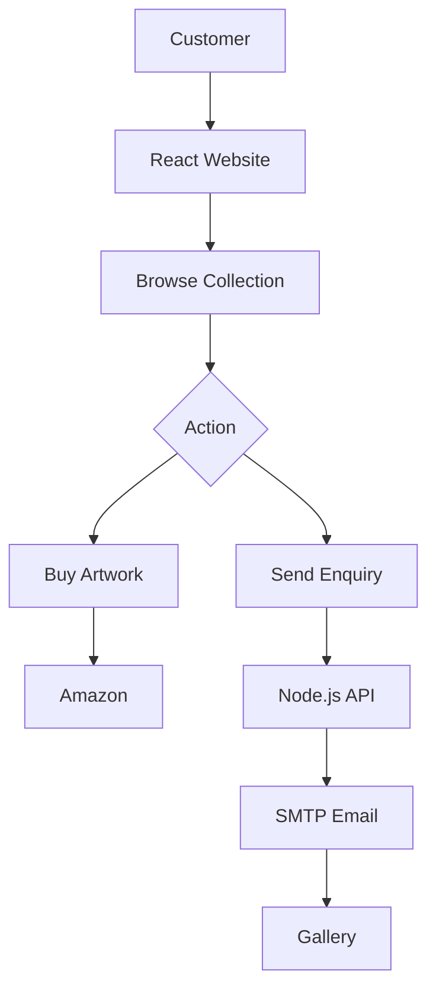
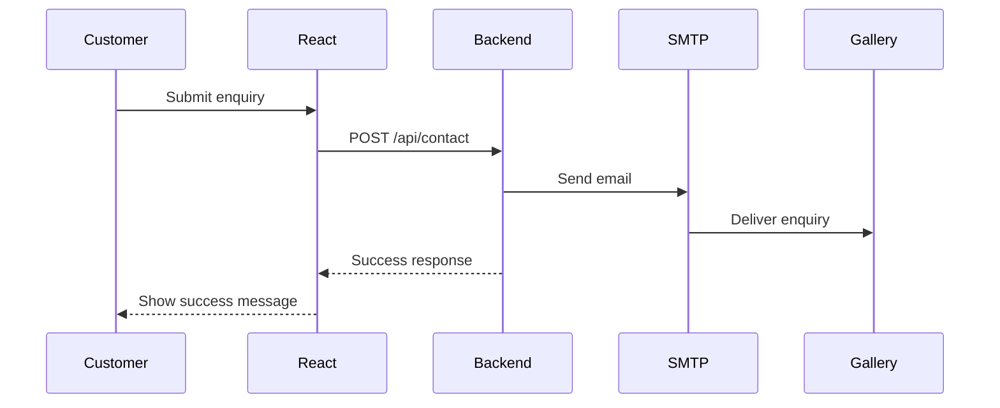

# 🎨 Pranu Art Gallery

A modern and artistic ecommerce website built to showcase artworks, provide product information, and allow customers to enquire or purchase artworks through Amazon.

## 📌 Project Overview

**Pranu Art Gallery** is a React-based frontend with a Node.js/Express backend.

The website combines an **art gallery experience** with simple ecommerce functionality.

---

## 🎯 Objectives

* Create an attractive online art gallery.
* Display artworks dynamically.
* Make product information easy to manage.
* Allow customers to enquire about artworks.
* Connect artworks to Amazon for purchasing.
* Provide a responsive experience on all devices.

---

## ✨ Actual Features

* 🎨 Artistic hero section
* 🖼️ Dynamic artwork collection
* 💰 Artwork price display
* 🛒 Buy artwork through Amazon
* 📧 Customer enquiry form
* 📩 Email notifications
* 👩‍🎨 Artist information section
* 📱 Responsive design
* ✨ CSS animations and hover effects
* 🔗 Social media links
* 🌐 Deployed online using Vercel

---

## 🛠️ Technology Stack

| Technology    | Purpose              |
| ------------- | -------------------- |
| React.js      | Frontend             |
| JavaScript    | Application logic    |
| CSS3          | Styling & animations |
| Node.js       | Backend              |
| Express.js    | API                  |
| Google Sheets | Product data         |
| Cloudinary    | Artwork images       |
| Nodemailer    | Sending emails       |
| SMTP          | Email delivery       |
| Amazon        | Product purchasing   |
| React Icons   | Icons                |
| Vercel        | Deployment           |
| GitHub        | Version control      |

---

## 🏗️ Frontend Architecture

```text
React App
   │
   ├── Navbar
   ├── Hero Section
   ├── Collection
   │      └── Product Cards
   ├── About Artist
   ├── Contact
   └── Footer
```

React manages the UI, product data, contact form, selected artwork, and user interactions.

---

## ⚙️ Backend Architecture

```text
React Frontend
      │
      ▼
Node.js + Express
      │
      ├── Products API
      │
      └── Contact API
             │
             ▼
        SMTP / Nodemailer
```

The backend handles API requests and email functionality.

---

## 🔄 Complete Application Workflow

```text
Customer
   ↓
React Website
   ↓
Browse Artworks
   ↓
Choose Action
   ├── View Artwork
   ├── Buy → Amazon
   └── Enquire → Node.js → SMTP → Gallery Email
```

---

## 👤 Customer Journey

```text
Open Website
     ↓
View Hero Section
     ↓
Explore Collection
     ↓
Select Artwork
     ↓
 ┌───────────────┐
 │               │
Buy             Enquire
 │               │
 ▼               ▼
Amazon       Contact Form
```

---

## 🛒 Artwork/Product Workflow

```text
Google Sheets
     ↓
Node.js API
     ↓
React Frontend
     ↓
Product Card
     ↓
Buy Button
     ↓
Amazon
```

---

## 📧 Contact/Enquiry Workflow

```text
Customer
   ↓
Contact Form
   ↓
POST /api/contact
   ↓
Node.js
   ↓
Nodemailer
   ↓
SMTP
   ↓
Gallery Email
```

---

## ☁️ Google Sheets Integration

Google Sheets is used to manage product information.

Basic product data includes:

```text
Product Name
Price
Image URL
Amazon URL
```

This allows product information to be updated without changing the React code.

---

## 🖼️ Cloudinary Integration

Cloudinary is used for artwork image hosting.

```text
Artwork Image
      ↓
Cloudinary
      ↓
Image URL
      ↓
Google Sheets
      ↓
Website
```

This keeps large artwork images outside the frontend project.

---

## 🛍️ Amazon Integration

The website uses Amazon product links for purchasing.

```text
Artwork
   ↓
Buy Button
   ↓
Amazon Product Page
   ↓
Customer Purchase
```

---

## 📩 SMTP/Nodemailer Integration

Nodemailer is used in the Node.js backend to send customer enquiries.

Customer information:

```text
Name
Email
Phone
Message
```

The customer's email is used as `replyTo`, allowing the gallery to reply directly to the customer.

---

## 🚀 Vercel Deployment

The project can be deployed using Vercel.

```text
Local Project
     ↓
GitHub
     ↓
Vercel
     ↓
Live Website
```

---

## 🎨 CSS/Artistic Animation Implementation

The website uses CSS for:

* Artistic backgrounds
* Paint-inspired effects
* Brush effects
* Image animations
* Hover effects
* Smooth transitions
* Scroll-based animations

The collection section keeps a cleaner ecommerce-style design for easier product browsing.

---

## 📱 Responsive Design

The website is designed for:

```text
Desktop
   ↓
Tablet
   ↓
Mobile
```

CSS media queries adjust:

* Layout
* Images
* Typography
* Product grids
* Navigation
* Spacing

---

## 🔐 Environment Variables & Security

Sensitive information is stored in environment variables.

Example:

```env
SMTP_EMAIL=your-email@example.com
SMTP_PASSWORD=your-password
ENQUIRY_EMAIL=gallery-email@example.com
```

Never upload `.env` to GitHub.

Recommended `.gitignore`:

```text
.env
node_modules/
dist/
```

---

## 🧩 APIs and Endpoints

### Get Products

```http
GET /api/products
```

Returns artwork/product information.

### Submit Enquiry

```http
POST /api/contact
```

Example request:

```json
{
  "name": "Customer Name",
  "email": "customer@example.com",
  "phone": "1234567890",
  "message": "I am interested in this artwork."
}
```

---

## 📊 Flowchart



---

## 🔀 Sequence Diagram



---

## 🗂️ Project Folder Structure

```text
pranu-art-gallery/
│
├── frontend/
│   ├── public/
│   ├── src/
│   │   ├── assets/
│   │   ├── App.jsx
│   │   ├── App.css
│   │   └── main.jsx
│   ├── index.html
│   └── package.json
│
├── backend/
│   ├── server.js
│   ├── package.json
│   └── .env
│
├── .gitignore
└── README.md
```

---

## 🧪 Testing

The following areas should be tested:

* [ ] Website loads correctly
* [ ] Products load correctly
* [ ] Artwork images display
* [ ] Buy button opens Amazon
* [ ] Contact form works
* [ ] Email is received by the gallery
* [ ] Reply-to customer email works
* [ ] Social links work
* [ ] Responsive layout works
* [ ] Animations work
* [ ] Favicon works
* [ ] API endpoints work

---

Yes. For a project README, the **Challenges Faced** section can be more detailed so it shows the actual development problems and how you solved them, without becoming too long.

You can replace your current **🐛 Challenges Actually Faced** section with this:

````markdown
## 🐛 Challenges Actually Faced

During the development of Pranu Art Gallery, several challenges were faced while combining an artistic website design with ecommerce functionality.

### 1. Creating an Artistic Ecommerce Design

One of the main challenges was creating a website that looked like an art gallery instead of a regular ecommerce website.

A normal ecommerce design usually focuses on products, prices, and buttons. However, an art gallery also needs to create an emotional and visual experience.

The challenge was to balance:

```text
Artistic Design
      +
Professional Website
      +
Ecommerce Usability
````

### Solution

A dark gallery-style theme was created with:

* Artistic backgrounds
* Paint-inspired gradients
* Brush effects
* Large artwork images
* Smooth transitions
* Hover animations
* Scroll-based animations

At the same time, the collection section was kept clean and simple so customers could easily view the artwork, price, and buy option.

---

### 2. Managing Artwork/Product Data

Another challenge was deciding how to manage artwork information.

Hardcoding every product directly inside React would make it difficult to update prices, artwork names, images, or Amazon links.

For example, changing one artwork would require changing the frontend code.

### Solution

Google Sheets was used as a simple product data source.

The workflow became:

```text
Google Sheets
      ↓
Node.js API
      ↓
React Frontend
      ↓
Product Cards
```

This allows product information to be managed separately from the frontend.

---

### 3. Managing Artwork Images

Artwork images are an important part of the website and can also be large in size.

Keeping all artwork images directly inside the React project could increase the project size and make image management difficult.

### Solution

Cloudinary was used for artwork image hosting.

The image workflow is:

```text
Artwork
   ↓
Cloudinary
   ↓
Image URL
   ↓
Google Sheets
   ↓
Backend
   ↓
React
```

This keeps the application lightweight and makes artwork images easier to manage.

---

### 4. Connecting Frontend and Backend

The React frontend and Node.js backend are separate parts of the application.

The challenge was making sure the frontend could correctly communicate with the backend APIs.

### Solution

REST API endpoints were created for the required functionality.

For example:

```text
React
  ↓
GET /api/products
  ↓
Node.js
  ↓
Product Data
  ↓
React
```

This separates the frontend UI from backend data handling.

---

### 5. Creating the Customer Enquiry System

The website needed a way for customers to contact the gallery without exposing email credentials in the frontend.

Sending emails directly from React would not be secure because SMTP credentials could potentially be exposed.

### Solution

The enquiry process was moved to the backend.

```text
Customer
   ↓
React Contact Form
   ↓
POST /api/contact
   ↓
Node.js
   ↓
Nodemailer
   ↓
SMTP
   ↓
Gallery Email
```

The frontend only sends the enquiry information to the backend.

---

### 6. Making Email Notifications Professional

The email sent to the gallery needed to contain all customer information in a clear and professional format.

A simple plain-text email could be difficult to read when multiple enquiries are received.

### Solution

A structured HTML email template was created containing:

* Gallery name
* Customer name
* Customer email
* Phone number
* Customer message
* Reply instructions

The customer's email is also used as the `replyTo` address so the gallery can easily reply to the customer.

---

### 7. Connecting Artwork Purchasing to Amazon

The website needed to provide a purchasing option without building a complete payment system.

Building a complete ecommerce payment and order management system would require additional features such as:

* Cart
* Payments
* Orders
* Payment verification
* Order tracking

### Solution

Amazon product links were used for purchasing.

The workflow is:

```text
Customer
   ↓
View Artwork
   ↓
Click Buy
   ↓
Amazon Product Page
   ↓
Complete Purchase
```

This keeps the website simple while still providing customers with a purchasing option.

---

### 8. Creating Scroll-Based Animations

Another challenge was making the website feel interactive while scrolling.

The goal was to create movement in the artistic background and artwork sections without making the website difficult to use.

### Solution

CSS animations and scroll-based effects were implemented.

These include:

* Animated background elements
* Paint effects
* Brush-style decorations
* Artwork movement
* Image hover effects
* Smooth transitions

The animations are mainly handled through CSS so that additional JavaScript logic is not required.

---

### 9. Keeping Animations and Ecommerce Usability Balanced

Too many animations can make an ecommerce website confusing or distracting.

The challenge was to make the website visually interesting while keeping important actions such as viewing prices and clicking the Buy button clear.

### Solution

The animations were mainly used in:

```text
Hero
About Artist
Background
Artwork Images
```

The collection/product cards were kept more structured and ecommerce-focused.

This creates:

```text
Artistic Experience
        ↓
Easy Product Browsing
        ↓
Clear Purchase Action
```

---

### 10. Responsive Artwork Display

Artwork images need to look good on large screens as well as small mobile screens.

A layout that looks good on desktop can easily become too large or crowded on mobile.

### Solution

Responsive CSS and media queries were used to adjust:

* Product grid
* Artwork size
* Typography
* Section spacing
* Navigation
* Contact form
* Buttons

The website was designed to work across:

```text
Desktop
   ↓
Tablet
   ↓
Mobile
```

---

### 11. Managing Sensitive Configuration

SMTP information contains sensitive credentials and should not be stored directly in frontend code or uploaded to GitHub.

### Solution

Environment variables were used for sensitive configuration.

Example:

```env
SMTP_EMAIL=your-email@example.com
SMTP_PASSWORD=your-password
ENQUIRY_EMAIL=gallery-email@example.com
```

The `.env` file is excluded from Git using `.gitignore`.

---

### 12. Maintaining a Simple Project Structure

The project contains several different technologies and integrations.

Managing React, Node.js, Google Sheets, Cloudinary, Amazon, and SMTP together could make the project difficult to understand.

### Solution

The application was separated into clear responsibilities:

```text
Frontend
   ↓
React UI

Backend
   ↓
Node.js API

Product Data
   ↓
Google Sheets

Images
   ↓
Cloudinary

Purchase
   ↓
Amazon

Enquiries
   ↓
Nodemailer + SMTP
```

This makes the overall application easier to understand and maintain.


## 💡 Solutions Implemented

| Challenge       | Solution              |
| --------------- | --------------------- |
| Product updates | Google Sheets         |
| Image hosting   | Cloudinary            |
| Purchasing      | Amazon links          |
| Email sending   | Node.js + Nodemailer  |
| Email security  | Environment variables |
| Artistic design | Custom CSS            |
| Animations      | CSS animations        |
| Mobile support  | Responsive CSS        |

---

## 🔮 Future Improvements

Possible future features:

* Shopping cart
* Online payment
* Product search
* Product categories
* Wishlist
* Individual artwork pages
* Admin dashboard
* Database integration
* Customer accounts
* Order management
* Customer confirmation emails
* Analytics

---

## 📝 Setup Instructions

### 1. Clone the project

```bash
git clone <repository-url>
cd pranu-art-gallery
```

### 2. Install frontend dependencies

```bash
cd frontend
npm install
```

### 3. Start frontend

```bash
npm run dev
```

### 4. Install backend dependencies

Open another terminal:

```bash
cd backend
npm install
```

### 5. Create `.env`

```env
SMTP_EMAIL=your-email@example.com
SMTP_PASSWORD=your-password
ENQUIRY_EMAIL=gallery-email@example.com
```

### 6. Start backend

```bash
node server.js
```

---

## 🎉 Conclusion

**Pranu Art Gallery** combines a creative art-gallery design with simple ecommerce functionality.

The project demonstrates the integration of:

```text
React
+
Node.js
+
Express
+
Google Sheets
+
Cloudinary
+
Amazon
+
Nodemailer
+
SMTP
+
Vercel
```

The result is a responsive and artistic website where customers can **discover artworks, enquire about them, and continue to Amazon for purchasing**.
